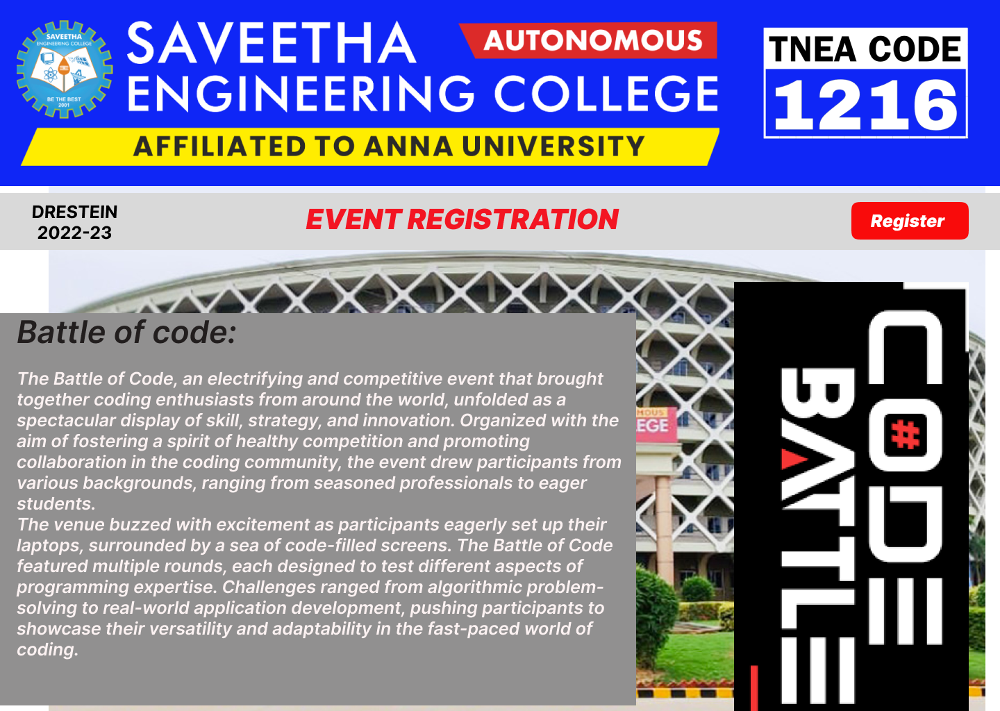
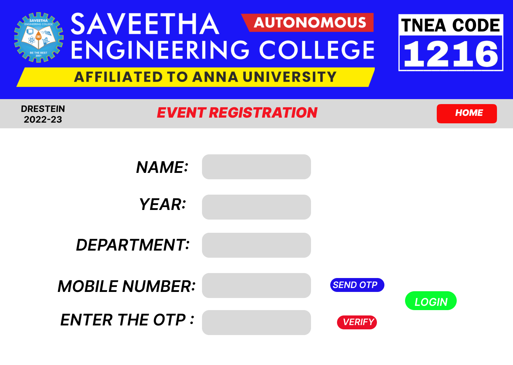
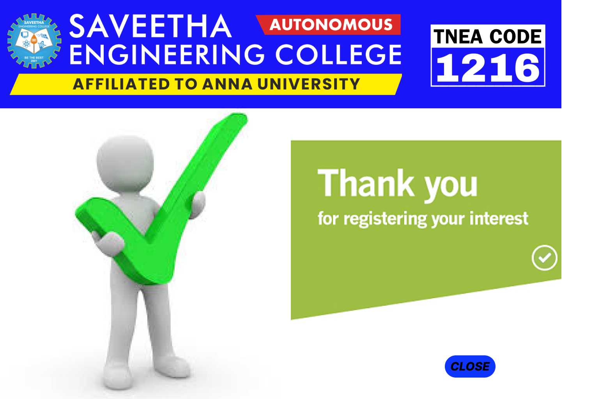

# Event Registration Web Application

## AIM:
To design, develop and deploy a web application for event registration.

## DESIGN STEPS:

### Step 1:
Create a new frame
### Step 2:
Select any one present size of your choice

### Step 3:
Select the shape you needed.

### Step 4:
Import images as needed and create pages based on your need and link there.

### Step 5:
Validate the HTML and CSS code.
### Step 6:

Validate the HTML and CSS code.


## DESIGN:
Figma

## PROGRAM :
homepage
```css
.main-container {
  overflow: hidden;
}

.main-container,
.main-container * {
  box-sizing: border-box;
}

.main-container {
  position: relative;
  width: 1440px;
  height: 1024px;
  margin: 0 auto;
  background: #ffffff;
  overflow: hidden;
}
.group {
  position: absolute;
  width: 1440px;
  height: 268px;
  top: 0;
  left: 0;
  background: #0f26f6;
  z-index: 10;
}
.pic {
  position: relative;
  width: 1012px;
  height: 210px;
  margin: 29px 0 0 24px;
  background: url(./assets/images/3b4d4a0d2ab10e8913c3f5e00582ea07cc3c1ce1.png)
    no-repeat center;
  background-size: cover;
  z-index: 11;
}
.box {
  position: absolute;
  width: 1544px;
  height: 1052px;
  top: 11px;
  left: -10px;
  z-index: 12;
}
.pic-2 {
  position: absolute;
  width: 575px;
  height: 280px;
  top: 0;
  left: 969px;
  background: url(./assets/images/b74348e9a2115950eee59c8a309e36af8bd235ea.png)
    no-repeat center;
  background-size: cover;
  z-index: 12;
}
.img {
  position: absolute;
  width: 1349px;
  height: 795px;
  top: 257px;
  left: 80px;
  background: url(./assets/images/d2b0b87b189fbc5becd6fd7e10693bfc14990f81.png)
    no-repeat center;
  background-size: cover;
}
.wrapper {
  display: flex;
  flex-direction: column;
  align-items: flex-start;
  flex-wrap: nowrap;
  gap: 10px;
  position: relative;
  width: 357px;
  height: 620px;
  margin: 128px 0 0 977px;
  padding: 10px 10px 10px 10px;
  z-index: 7;
}
.pic-3 {
  flex-shrink: 0;
  position: relative;
  width: 338px;
  height: 657px;
  background: url(./assets/images/fb8fd4d8-b89b-4380-8cfe-a8c98b7818e7.png)
    no-repeat center;
  background-size: cover;
  transform: rotate(90deg);
  z-index: 8;
}
.group-2 {
  position: absolute;
  width: 1440px;
  height: 82px;
  top: 267px;
  left: 10px;
  background: #d9d9d9;
  z-index: 2;
}
.text {
  display: flex;
  align-items: flex-start;
  justify-content: center;
  position: absolute;
  width: 1089px;
  height: 54px;
  top: 13px;
  left: 121px;
  font-family: Inter, -apple-system, BlinkMacSystemFont, "Segoe UI", Roboto,
    Ubuntu, "Helvetica Neue", Helvetica, Arial, "PingFang SC",
    "Hiragino Sans GB", "Microsoft Yahei UI", "Microsoft Yahei",
    "Source Han Sans CN", sans-serif;
  color: #f21422;
  font-size: 40px;
  font-weight: 900;
  line-height: 48.409px;
  text-align: center;
  white-space: nowrap;
  z-index: 3;
}
.wrapper-2 {
  position: absolute;
  width: 169px;
  height: 54px;
  top: 13px;
  left: 1226px;
  background: #f80b0b;
  z-index: 4;
  border-radius: 10px;
}
.text-2 {
  display: flex;
  align-items: flex-start;
  justify-content: center;
  position: absolute;
  width: 194px;
  height: 54px;
  top: 25px;
  left: 1210px;
  font-family: Inter, -apple-system, BlinkMacSystemFont, "Segoe UI", Roboto,
    Ubuntu, "Helvetica Neue", Helvetica, Arial, "PingFang SC",
    "Hiragino Sans GB", "Microsoft Yahei UI", "Microsoft Yahei",
    "Source Han Sans CN", sans-serif;
  color: #ffffff;
  font-size: 25px;
  font-weight: 900;
  line-height: 30.256px;
  text-align: center;
  z-index: 5;
}
.text-3 {
  display: flex;
  align-items: flex-start;
  justify-content: center;
  position: absolute;
  width: 235px;
  height: 58px;
  top: 279px;
  left: 0;
  font-family: Inter, -apple-system, BlinkMacSystemFont, "Segoe UI", Roboto,
    Ubuntu, "Helvetica Neue", Helvetica, Arial, "PingFang SC",
    "Hiragino Sans GB", "Microsoft Yahei UI", "Microsoft Yahei",
    "Source Han Sans CN", sans-serif;
  color: #000000;
  font-size: 25px;
  font-weight: 700;
  line-height: 30.256px;
  text-align: center;
  z-index: 9;
}
.pic-4 {
  position: absolute;
  width: 916px;
  height: 565px;
  top: 440px;
  left: 10px;
  background: url(./assets/images/a0c20598-ad74-4d9d-a274-746291a8b3c8.png)
    no-repeat center;
  background-size: cover;
  z-index: 1;
}
.group-3 {
  position: absolute;
  width: 894px;
  height: 520px;
  top: 440px;
  left: 34px;
  font-family: Inter, -apple-system, BlinkMacSystemFont, "Segoe UI", Roboto,
    Ubuntu, "Helvetica Neue", Helvetica, Arial, "PingFang SC",
    "Hiragino Sans GB", "Microsoft Yahei UI", "Microsoft Yahei",
    "Source Han Sans CN", sans-serif;
  font-size: 45px;
  font-weight: 600;
  line-height: 54.46px;
  text-align: left;
  z-index: 6;
}
.text-4 {
  position: relative;
  font-family: Inter, -apple-system, BlinkMacSystemFont, "Segoe UI", Roboto,
    Ubuntu, "Helvetica Neue", Helvetica, Arial, "PingFang SC",
    "Hiragino Sans GB", "Microsoft Yahei UI", "Microsoft Yahei",
    "Source Han Sans CN", sans-serif;
  color: #211e1e;
  font-size: 45px;
  font-weight: 600;
  line-height: 54.46px;
  text-align: left;
}
.text-5 {
  position: relative;
  font-family: Inter, -apple-system, BlinkMacSystemFont, "Segoe UI", Roboto,
    Ubuntu, "Helvetica Neue", Helvetica, Arial, "PingFang SC",
    "Hiragino Sans GB", "Microsoft Yahei UI", "Microsoft Yahei",
    "Source Han Sans CN", sans-serif;
  color: rgba(255, 248, 248, 0);
  font-size: 25px;
  font-weight: 600;
  line-height: 54.46px;
  text-align: left;
}
.text-6 {
  position: relative;
  font-family: Inter, -apple-system, BlinkMacSystemFont, "Segoe UI", Roboto,
    Ubuntu, "Helvetica Neue", Helvetica, Arial, "PingFang SC",
    "Hiragino Sans GB", "Microsoft Yahei UI", "Microsoft Yahei",
    "Source Han Sans CN", sans-serif;
  color: #fcf1f1;
  font-size: 25px;
  font-weight: 600;
  line-height: 54.46px;
  text-align: left;
}
```
loginpage
```css
.main-container {
  overflow: hidden;
}

.main-container,
.main-container * {
  box-sizing: border-box;
}

.main-container {
  position: relative;
  width: 1440px;
  height: 1024px;
  margin: 0 auto;
  background: #ffffff;
  overflow: hidden;
}
.section {
  position: relative;
  width: 1553px;
  height: 360px;
  margin: 0 0 0 0;
  z-index: 4;
}
.section-2 {
  position: absolute;
  width: 1440px;
  height: 278px;
  top: 0;
  left: 0;
  background: #1915f7;
}
.img {
  position: relative;
  width: 1012px;
  height: 210px;
  margin: 34px 0 0 40px;
  background: url(./assets/images/3b4d4a0d2ab10e8913c3f5e00582ea07cc3c1ce1.png)
    no-repeat center;
  background-size: cover;
  z-index: 1;
}
.pic {
  position: absolute;
  width: 575px;
  height: 280px;
  top: 11px;
  left: 978px;
  background: url(./assets/images/b74348e9a2115950eee59c8a309e36af8bd235ea.png)
    no-repeat center;
  background-size: cover;
  z-index: 3;
}
.box {
  position: absolute;
  width: 1440px;
  height: 82px;
  top: 278px;
  left: 0;
  background: #d9d9d9;
  z-index: 4;
}
.text {
  display: flex;
  align-items: flex-start;
  justify-content: center;
  position: absolute;
  width: 235px;
  height: 58px;
  top: 12px;
  left: 3px;
  font-family: Inter, -apple-system, BlinkMacSystemFont, "Segoe UI", Roboto,
    Ubuntu, "Helvetica Neue", Helvetica, Arial, "PingFang SC",
    "Hiragino Sans GB", "Microsoft Yahei UI", "Microsoft Yahei",
    "Source Han Sans CN", sans-serif;
  color: #000000;
  font-size: 25px;
  font-weight: 700;
  line-height: 30.256px;
  text-align: center;
  z-index: 6;
}
.text-2 {
  display: flex;
  align-items: flex-start;
  justify-content: center;
  position: absolute;
  width: 1089px;
  height: 54px;
  top: 13px;
  left: 121px;
  font-family: Inter, -apple-system, BlinkMacSystemFont, "Segoe UI", Roboto,
    Ubuntu, "Helvetica Neue", Helvetica, Arial, "PingFang SC",
    "Hiragino Sans GB", "Microsoft Yahei UI", "Microsoft Yahei",
    "Source Han Sans CN", sans-serif;
  color: #f21422;
  font-size: 40px;
  font-weight: 900;
  line-height: 48.409px;
  text-align: center;
  white-space: nowrap;
  z-index: 5;
}
.group {
  position: absolute;
  width: 169px;
  height: 54px;
  top: 14px;
  left: 1226px;
  background: #f80b0b;
  z-index: 23;
  border-radius: 10px;
}
.text-3 {
  display: flex;
  align-items: flex-start;
  justify-content: center;
  position: absolute;
  width: 120px;
  height: 29px;
  top: 9px;
  left: 31px;
  font-family: Inter, -apple-system, BlinkMacSystemFont, "Segoe UI", Roboto,
    Ubuntu, "Helvetica Neue", Helvetica, Arial, "PingFang SC",
    "Hiragino Sans GB", "Microsoft Yahei UI", "Microsoft Yahei",
    "Source Han Sans CN", sans-serif;
  color: #ffffff;
  font-size: 25px;
  font-weight: 900;
  line-height: 29px;
  text-align: center;
  white-space: nowrap;
  z-index: 24;
}
.box-2 {
  position: relative;
  width: 509px;
  height: 79px;
  margin: 73px 0 0 364px;
  z-index: 11;
}
.section-3 {
  position: absolute;
  width: 306px;
  height: 70px;
  top: 0;
  left: 203px;
  background: #d9d9d9;
  z-index: 11;
  border-radius: 20px;
}
.text-4 {
  display: flex;
  align-items: flex-start;
  justify-content: center;
  position: absolute;
  width: 182px;
  height: 70px;
  top: 9px;
  left: 0;
  font-family: Inter, -apple-system, BlinkMacSystemFont, "Segoe UI", Roboto,
    Ubuntu, "Helvetica Neue", Helvetica, Arial, "PingFang SC",
    "Hiragino Sans GB", "Microsoft Yahei UI", "Microsoft Yahei",
    "Source Han Sans CN", sans-serif;
  color: #000000;
  font-size: 45px;
  font-weight: 600;
  line-height: 54.46px;
  text-align: center;
  white-space: nowrap;
  z-index: 7;
}
.box-3 {
  display: flex;
  align-items: center;
  justify-content: space-between;
  position: relative;
  width: 509px;
  height: 70px;
  margin: 34px 0 0 364px;
  z-index: 14;
}
.text-5 {
  display: flex;
  align-items: flex-start;
  justify-content: center;
  flex-shrink: 0;
  position: relative;
  width: 182px;
  height: 70px;
  font-family: Inter, -apple-system, BlinkMacSystemFont, "Segoe UI", Roboto,
    Ubuntu, "Helvetica Neue", Helvetica, Arial, "PingFang SC",
    "Hiragino Sans GB", "Microsoft Yahei UI", "Microsoft Yahei",
    "Source Han Sans CN", sans-serif;
  color: #000000;
  font-size: 45px;
  font-weight: 600;
  line-height: 54.46px;
  text-align: center;
  white-space: nowrap;
  z-index: 10;
}
.group-2 {
  flex-shrink: 0;
  position: relative;
  width: 306px;
  height: 70px;
  background: #d9d9d9;
  z-index: 14;
  border-radius: 20px;
}
.section-4 {
  display: flex;
  align-items: center;
  justify-content: space-between;
  position: relative;
  width: 665px;
  height: 70px;
  margin: 37px 0 0 208px;
  z-index: 15;
}
.text-6 {
  display: flex;
  align-items: flex-start;
  justify-content: center;
  flex-shrink: 0;
  position: relative;
  width: 329px;
  height: 56px;
  font-family: Inter, -apple-system, BlinkMacSystemFont, "Segoe UI", Roboto,
    Ubuntu, "Helvetica Neue", Helvetica, Arial, "PingFang SC",
    "Hiragino Sans GB", "Microsoft Yahei UI", "Microsoft Yahei",
    "Source Han Sans CN", sans-serif;
  color: #000000;
  font-size: 45px;
  font-weight: 600;
  line-height: 54.46px;
  text-align: center;
  white-space: nowrap;
  z-index: 9;
}
.section-5 {
  flex-shrink: 0;
  position: relative;
  width: 306px;
  height: 70px;
  background: #d9d9d9;
  z-index: 15;
  border-radius: 20px;
}
.box-4 {
  position: relative;
  width: 1139px;
  height: 104px;
  margin: 43px 0 0 143px;
  z-index: 21;
}
.group-3 {
  position: absolute;
  width: 715px;
  height: 104px;
  top: 0;
  left: 424px;
  z-index: 21;
}
.section-6 {
  position: absolute;
  width: 306px;
  height: 70px;
  top: 0;
  left: 0;
  background: #d9d9d9;
  z-index: 12;
  border-radius: 20px;
}
.group-4 {
  position: absolute;
  width: 152px;
  height: 39px;
  top: 14px;
  left: 360px;
  background: #1f0de9;
  z-index: 16;
  border-radius: 50px;
}
.text-7 {
  display: flex;
  align-items: flex-start;
  justify-content: center;
  position: absolute;
  width: 139px;
  height: 22px;
  top: 4px;
  left: 0;
  font-family: Inter, -apple-system, BlinkMacSystemFont, "Segoe UI", Roboto,
    Ubuntu, "Helvetica Neue", Helvetica, Arial, "PingFang SC",
    "Hiragino Sans GB", "Microsoft Yahei UI", "Microsoft Yahei",
    "Source Han Sans CN", sans-serif;
  color: #ffffff;
  font-size: 25px;
  font-weight: 600;
  line-height: 22px;
  text-align: center;
  white-space: nowrap;
  z-index: 18;
}
.wrapper {
  position: absolute;
  width: 145px;
  height: 53px;
  top: 51px;
  left: 570px;
  background: #08fc2f;
  z-index: 21;
  border-radius: 50px;
}
.text-8 {
  display: flex;
  align-items: flex-start;
  justify-content: center;
  position: absolute;
  width: 112px;
  height: 29px;
  top: 12px;
  left: 17px;
  font-family: Inter, -apple-system, BlinkMacSystemFont, "Segoe UI", Roboto,
    Ubuntu, "Helvetica Neue", Helvetica, Arial, "PingFang SC",
    "Hiragino Sans GB", "Microsoft Yahei UI", "Microsoft Yahei",
    "Source Han Sans CN", sans-serif;
  color: #ffffff;
  font-size: 30px;
  font-weight: 600;
  line-height: 29px;
  text-align: center;
  white-space: nowrap;
  z-index: 22;
}
.text-9 {
  display: flex;
  align-items: flex-start;
  justify-content: center;
  position: absolute;
  width: 424px;
  height: 60px;
  top: 10px;
  left: 0;
  font-family: Inter, -apple-system, BlinkMacSystemFont, "Segoe UI", Roboto,
    Ubuntu, "Helvetica Neue", Helvetica, Arial, "PingFang SC",
    "Hiragino Sans GB", "Microsoft Yahei UI", "Microsoft Yahei",
    "Source Han Sans CN", sans-serif;
  color: #000000;
  font-size: 45px;
  font-weight: 600;
  line-height: 54.46px;
  text-align: center;
  white-space: nowrap;
  z-index: 8;
}
.box-5 {
  position: relative;
  width: 901px;
  height: 70px;
  margin: 0 0 0 165px;
  z-index: 20;
}
.text-a {
  display: flex;
  align-items: flex-start;
  justify-content: center;
  position: absolute;
  width: 384px;
  height: 59px;
  top: 0;
  left: 0;
  font-family: Inter, -apple-system, BlinkMacSystemFont, "Segoe UI", Roboto,
    Ubuntu, "Helvetica Neue", Helvetica, Arial, "PingFang SC",
    "Hiragino Sans GB", "Microsoft Yahei UI", "Microsoft Yahei",
    "Source Han Sans CN", sans-serif;
  color: #000000;
  font-size: 45px;
  font-weight: 600;
  line-height: 54.46px;
  text-align: center;
  white-space: nowrap;
  z-index: 19;
}
.group-5 {
  position: absolute;
  width: 306px;
  height: 70px;
  top: 0;
  left: 402px;
  background: #d9d9d9;
  z-index: 13;
  border-radius: 20px;
}
.wrapper-2 {
  position: absolute;
  width: 112px;
  height: 39px;
  top: 15px;
  left: 781px;
  background: #e90d28;
  z-index: 17;
  border-radius: 50px;
}
.text-b {
  display: flex;
  align-items: flex-start;
  justify-content: center;
  position: absolute;
  width: 120px;
  height: 36px;
  top: 18px;
  left: 781px;
  font-family: Inter, -apple-system, BlinkMacSystemFont, "Segoe UI", Roboto,
    Ubuntu, "Helvetica Neue", Helvetica, Arial, "PingFang SC",
    "Hiragino Sans GB", "Microsoft Yahei UI", "Microsoft Yahei",
    "Source Han Sans CN", sans-serif;
  color: #ffffff;
  font-size: 25px;
  font-weight: 600;
  line-height: 30.256px;
  text-align: center;
  white-space: nowrap;
  z-index: 20;
}
```
successpage
```css
.main-container {
  overflow: hidden;
}

.main-container,
.main-container * {
  box-sizing: border-box;
}

.main-container {
  position: relative;
  width: 1440px;
  height: 1024px;
  margin: 0 auto;
}
.box {
  position: absolute;
  width: 1440px;
  height: 1024px;
  top: 0;
  left: 0;
  background: #d9d9d9;
}
.wrapper {
  position: absolute;
  width: 1440px;
  height: 278px;
  top: 0;
  left: 0;
  background: #1915f7;
  z-index: 1;
}
.pic {
  position: absolute;
  width: 1012px;
  height: 210px;
  top: 34px;
  left: 19px;
  background: url(./assets/images/3b4d4a0d2ab10e8913c3f5e00582ea07cc3c1ce1.png)
    no-repeat center;
  background-size: cover;
  z-index: 2;
}
.pic-2 {
  position: absolute;
  width: 575px;
  height: 280px;
  top: 34px;
  left: 964px;
  background: url(./assets/images/b74348e9a2115950eee59c8a309e36af8bd235ea.png)
    no-repeat center;
  background-size: cover;
  z-index: 3;
}
.wrapper-2 {
  position: absolute;
  width: 1252px;
  height: 644px;
  top: 278px;
  left: 19px;
  z-index: 4;
}
.img {
  position: absolute;
  width: 746px;
  height: 746px;
  top: 278px;
  left: 0;
  background: url(./assets/images/8b5f224c7df9b3178c996022694616bf80b31226.png)
    no-repeat center;
  background-size: cover;
  z-index: 5;
}
.pic-3 {
  position: absolute;
  width: 694px;
  height: 624px;
  top: 278px;
  left: 746px;
  background: url(./assets/images/edd6c1e4deb7d755acfd83b981c3e5408bf166fc.png)
    no-repeat center;
  background-size: cover;
  z-index: 6;
}
.wrapper-3 {
  position: absolute;
  width: 720px;
  height: 125px;
  top: 899px;
  left: 720px;
  background: #ffffff;
  z-index: 7;
}
.wrapper-4 {
  position: absolute;
  width: 130px;
  height: 57px;
  top: 912px;
  left: 1141px;
  background: #0e34fd;
  z-index: 8;
  border-radius: 45px;
}
.text {
  display: flex;
  align-items: flex-start;
  justify-content: center;
  position: absolute;
  width: 163px;
  height: 40px;
  top: 922px;
  left: 1124px;
  font-family: Inter, -apple-system, BlinkMacSystemFont, "Segoe UI", Roboto,
    Ubuntu, "Helvetica Neue", Helvetica, Arial, "PingFang SC",
    "Hiragino Sans GB", "Microsoft Yahei UI", "Microsoft Yahei",
    "Source Han Sans CN", sans-serif;
  color: #000000;
  font-size: 30px;
  font-weight: 800;
  line-height: 36.307px;
  text-align: center;
  white-space: nowrap;
  z-index: 9;
exp
```


## OUTPUT:




## Result:

The program to design .develope and display a web application for event registration is completed successfully.